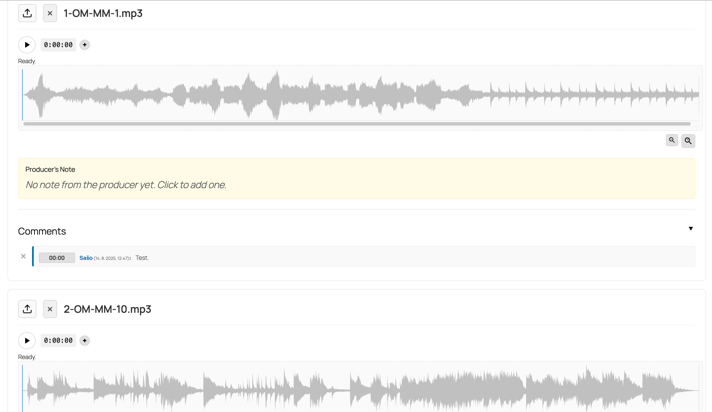

# MP3 Waveform Uploader & Annotator

## 🔊 Usage Preview

**Contributors:** sasofajon  
**Tags:** audio, mp3, waveform, player, comments, annotations, music, feedback  
**Requires at least:** 6.0  
**Tested up to:** 6.0.8  
**Stable tag:** 1.0.0  
**License:** GPLv2 or later  
**License URI:** https://www.gnu.org/licenses/gpl-2.0.html  

An advanced audio player with a zoomable waveform and timestamped annotations.  
Inspired by SoundCloud. Designed for musicians, podcasters, and educational content.

---

## ✨ Features

- Upload `.mp3` files via media library or frontend form
- Display interactive waveform using [WaveSurfer.js](https://wavesurfer-js.org/)
- Timestamped comments with AJAX support
- Admin interface for managing notes and player settings
- Responsive design, works in most themes
- Timeline markers and producer note field
- Optional zoom-in / zoom-out controls

---

## 🛠️ Usage

Use the following shortcode to embed a player: [mp3_waveform_uploader id=“unique_id”]
Replace `"unique_id"` with a custom value to uniquely identify each audio instance.

---

## ⚙️ Installation

1. Upload the plugin folder to `/wp-content/plugins/`
2. Activate the plugin from the WordPress dashboard
3. Use the shortcode in any post, page or widget

---

## 💡 Developer Notes

- Comments are stored in WordPress options table using the unique ID as key
- Uses `WaveSurfer.js` for waveform and timeline display
- AJAX endpoints are namespaced for minimal conflicts
- Fully self-contained, no external dependencies

---

## 📄 License

This plugin is licensed under the [GNU GPL v2.0](https://www.gnu.org/licenses/gpl-2.0.html) or later.

---

## ✍️ Author

**Sašo Fajon**  
Piran, Slovenia  
https://github.com/SireGrindalot
